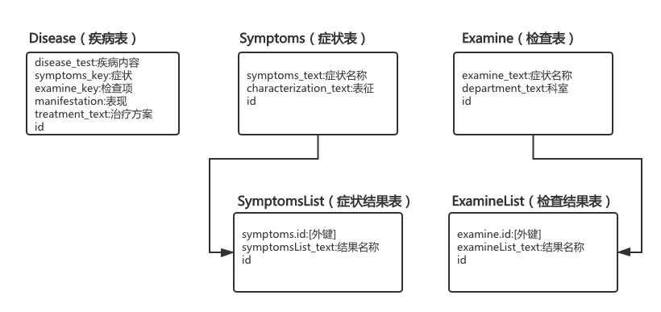
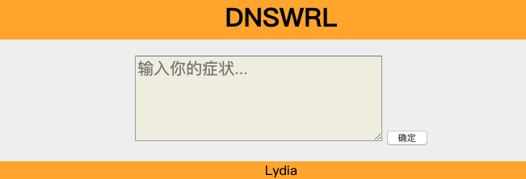
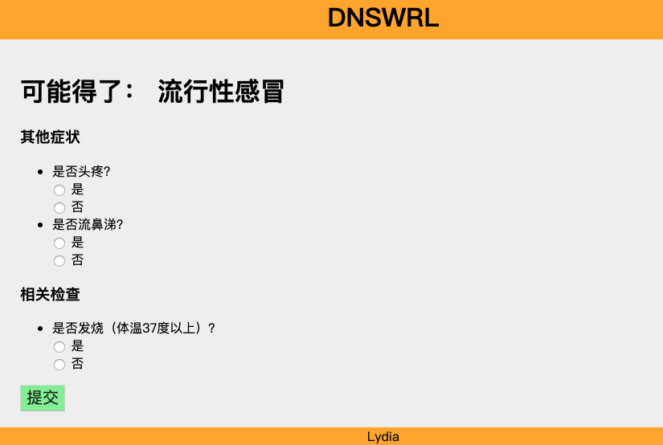
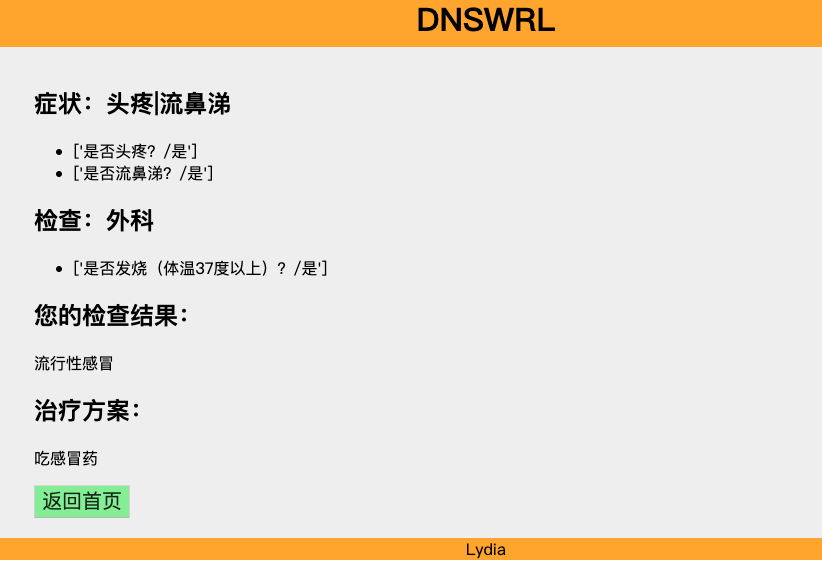

# DNSWRL-python
DNSWRL的python实现版

### 用到的库
- django
- pyjsgf

### 使用说明
1、安装python相关库
```bash
pip install -r requirements.txt
```
2、运行Django
```bash
python manage.py runserver
```

### 其他你可能想知道的操作
- 创建数据库管理员
```bash
python manage.py createsuperuser

# 按顺序输入
# 1、用户名；
# 2、邮箱(可直接回车跳过)；
# 3、密码(输入时不显示，默认隐藏)
```
- 启动开发服务器
```bash
python manage.py runserver
```
浏览器输入："http://127.0.0.1:8000/admin/"(此处前面的ip:端口号可能会由于机器的不同不一致)

### 数据关系映射示意图


### 网站部分截图
###### 输入

###### 选择

###### 结果

